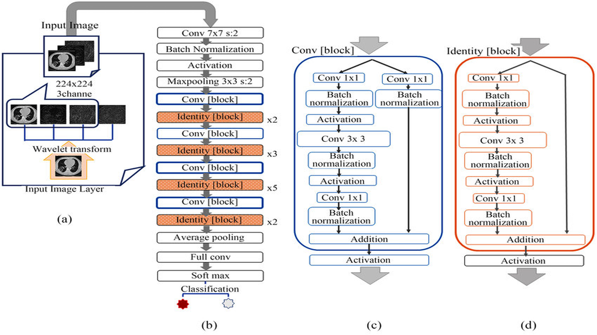

## 简介
这个仓库是用来储存 medmnist 3D医学影像多分类的代码
checkpoints是用来储存最好的模型结果的，将最好的模型放在project中做实时分类。

  

## 硬件配置
Nvidia 3060Ti
Cuda 12.5 Cudnn 8.4.1

## requirements
```
numpy==1.21.2
torch==1.13.0
torchvision==0.14.0
tqdm==4.62.3
Pillow==8.4.0
matplotlib==3.4.3
flask==2.0.2
tensorboard==2.7.0
medmnist==2.2.1
protobuf==3.20.3
```

## 数据集
数据集为[Medmnist]

  
  

## 模型
基础模型链接：[ResNet50](https://github.com/pytorch/vision/blob/main/torchvision/models/resnet.py)

  

## 运行

启动环境：(配置自己的gpu环境）

```bash
conda create -n pytorch_gpu python=3.10
```

下载gpu驱动与对应pytorch的包

```bash
conda activate pytorch_gpu
pip install -r requirements
```

**训练模型:**

```python
python train_resnet50.py
```

**测试模型：**
```python
python test.py
```

**训练结果：**
准确率为0.842，相对不错，但是ROC曲线比较差，可以尝试使用其他模型
  
  

**训练过程**

最后准确率超过95%时，loss下降到0.1以下。


**前端展示：(位于project文件夹下,使用flask框架进行展示)**
将训练好的 best_model.pth 文件夹下放在 /project/models 文件夹下

```
cd project
python app.py
```


**对比其他模型：**


